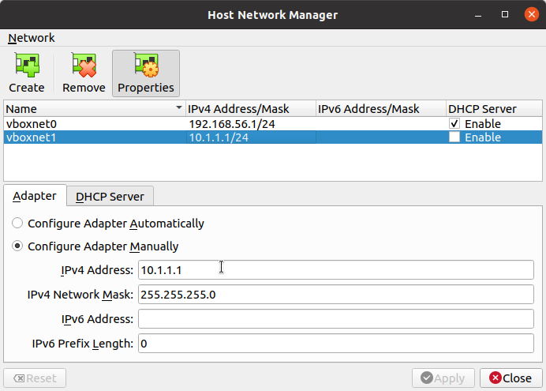

# devops-vagrantfiles
Collection of Vagrantfile resources.


## Quickstart

```bash
# Start VMs
vagrant up

# Destroy VMs
vagrant destroy -f
```

## Requirement

### VirtualBox network setting

The default VM's "private network" is `10.1.1.*` (ref: [./00-base/0010-cluster/usr/VMs.rb](./00-base/0010-cluster/usr/VMs.rb) ), so the adapter of these IP address range in Host Network Manager should be configured：



**NOTE**：VirtualBox about 6.1.28, host-only network adapters are restricted to IPs in the range 192.168.56.0/21 by default (192.168.56.1 -> 192.168.63.254). You can tell VirtualBox to allow additional IP ranges by configuring `/etc/vbox/networks.conf`( ref: https://stackoverflow.com/questions/69722254/vagrant-up-failing-for-virtualbox-provider-with-e-accessdenied-on-host-only-netw and https://www.virtualbox.org/manual/ch06.html#network_hostonly ):

```bash
sudo -i
echo "* 10.1.1.0/24" >> /etc/vbox/networks.conf
```

